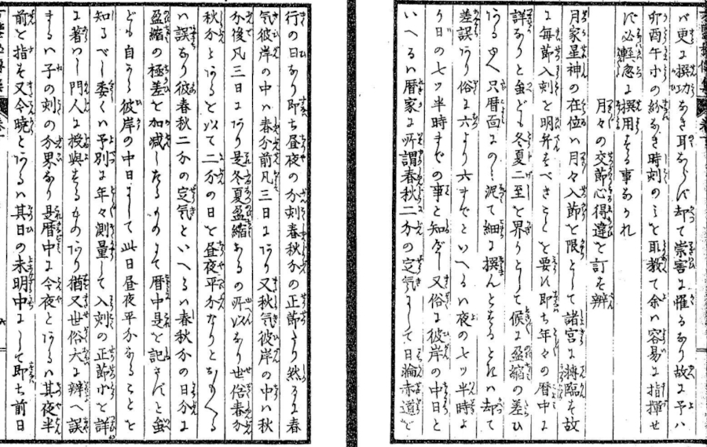

# towngach

A computational library for East Asian calendrical,
astronomical, directional, and purple-white nine-star
traditions &mdash; combining solar-term and celestial
calculations with historically distinct methods
for annual, monthly, daily, and hourly divination.

## 1. About


### What is "Towngach"?

The name **Towngach** (`/taʊŋˈɡætʃ/`) originates from "Tawgač" (`/tɑwˈɣɑtʃ/` or tahw-GHAHCH) or "Tabgach" (`/tɑbˈɣɑtʃ/` or tahb-GHAHCH), an ancient Turkic (突厥) term recorded in historical monuments like the Bilge Khagan Inscription (毗伽可汗碑) to denote the Tang Dynasty (唐) and the vast sovereign realm of China. Grammatically, the suffix `-č` in Ancient Turkic signifies _"people of"_ or _"clan of"_. The root traces back to the Tuobay (拓跋) clan of the Xianbei (鮮卑) who founded the Northern Wei Dynasty (北魏). To the Turks (突厥) and Sogdian (ソグド) merchants along the Silk Road, this word transcended a single clan name to become a universal noun representing _"the sovereign imperial domain of the East, bathed in celestial light"_.

This royal bloodline of the Tuoba (拓跋) clan-endowed with advanced metal refining technologies and military prowess &mdash; originally migrated eastward from ancient Western Asia (Sumer and Babylonia). Centuries later, this same lineage founded the Western Xia Dynasty (西夏). The royal family carried this ancient heritage, creating _"the Tangut script"_ (西夏文字) as a revival of the sacred, highly mystical pictographs from China's ancient Shang Dynasty (殷) &mdash; a script from an era before characters became abstracted, preserving intense spiritual depth.

Furthermore, the state religion of Western Xia (西夏) was a deeply mystical Esoteric Buddhism (密教) transmitted from Tibet and Central Asia. This ritualistic tradition placed supreme importance on the positions and movements of celestial bodies, including the Sun, Moon, and the Big Dipper (北斗七星). This cosmic veneration directly inherited the ancient astral worship of Sumer and Babylonia, where priests observed the night sky to commune with the divine. Flowing through Persia and India, this astral lore culminated during the Tang Dynasty (唐) and infused the entire East Asian cultural sphere.

Although East Asian astrological calculations &mdash; such as "nine-stars" (九星), "qimen-dunjia" (奇門遁甲), and "ziwei-doushu" (紫微斗数) &mdash; eventually branched into specialized systems across different regions, they all share this single, grand origin.

By taking the name as **"Towngach"**, this library honors that deep historical thread: connecting Mesopotamian celestial worship, the metallurgical and royal heritage of the Tuoba (拓跋) clan, the mystical arts of Tang-era Asia, and modern computational algorithms into a single unified toolkit.

### Scope: "Purple-White Nine-Stars" (紫白九星) rather than "Qimen Nine-Stars" (奇門九星)

This library is primarily concerned with the calculation and movement of the **"purple-white-nine-stars"** (紫白九星 / cửu tinh tử bạch) through the **"nine-palaces"** (九宮 / cửu cung). Its subject is therefore the cosmological and calendrical system of stars commonly represented by the numbers and colors **"one-white"** (一白 / nhất bạch) through **"nine-purple"** (九紫 / cửu-tử), and their movement according to the structure of the **"luo-shu"** (洛書 / 洛书 / lạc thư) and the **"nine-palaces"** (九宮).

The library does not, at least in its primary scope, attempt to calculate the nine stars of **"qimen-dunjia"** (奇門遁甲 / 奇门遁甲 / kỳ môn độn giáp), such as "tian-peng" (天蓬星 / thiên bồng), "tinh-tian-rui" (天芮星 / thiên nhuế), "tinh-tian-chong" (天衝星 / 天冲星 / thiên xung tinh) and the other stars belonging to that system. Although both traditions use the expression "Nine Stars", they represent different technical systems.

### A Shared Foundation: "Purple-White Stars" (紫白九星) and the "Nine-Palaces" (九宮)

The common foundation of the systems covered by this library is the relationship between the **"purple-white-nine-stars"** (紫白九星) and the **"nine-palaces"** (九宮). A star may be assigned to the central palace (中宮) and then allowed to move through the palace (宮) sequence according to a defined rule. Depending on the method, this movement may proceed forward or backward, corresponding to forward flight (順飛 / 顺飞 / thuận phi) and reverse flight (逆飛 / 逆飞 / nghịch phi).

This common foundation makes it possible for apparently different traditions to share a substantial amount of computational logic. The same **"nine-palace"** (九宮) structure can support annual, monthly, daily, and hourly calculations, even when the rules used to determine the initial star or the calendrical boundary differ.

### Four Calendrical Levels

The **"purple-white"** (紫白) system is commonly applied at four calendrical levels: **annual calculation** (年家 / niên gia), **monthly calculation** (月家 / nguyệt gia), **daily calculation** (日家 / nhật gia), and **hourly calculation** (時家 / 时家 / thời gia).

These four levels should not necessarily be understood as four unrelated systems. They share the same general cosmological vocabulary of **"purple-white stars"** (紫白九星) and the **"nine-palaces"** (九宮), but each level may define its own temporal cycles, starting points, transitions, and rules for determining the initial star. For this reason, a reusable implementation should recognize both their shared structure and their independent calendrical logic.

### Classical "Three-Epoch Purple-White" (三元紫白) Traditions

One major family of methods is the classical **"three-epochs-purple-white"** (三元紫白 / tam nguyên tử bạch) system found in Chinese calendrical and selection traditions. Within this family, annual (年家), monthly (月家), daily (日家), and hourly (時家) purple-white (紫白) calculations are treated as related expressions of the same general system.

The **annual calculation** (年家) is based on the large cycle of the **"three-epochs"** (三元 / tam nguyên), traditionally expressed through a sequence of 60 year units and a larger 180 year cycle. The **monthly calculation** (月家) uses its own relationship between annual cycles (歲運 / 岁运 / tuế vận), terrestrial branches (地支 / địa chi), and the monthly sequence (月建 / 月建 / nguyệt kiến). The **daily calculation** (日家) is based on a 60 day unit and a larger cycle of 3 such units. The **hourly calculation** (時家) again uses its own division of time, often derived from the classification of the day and the sequence of the traditional **"double-hours"** (時辰 / 时辰 / giờ âm lịch).

These methods form an important baseline for the library because they provide one of the most coherent historical families of "purple-white" (紫白) calculations.

### Houkan (方鑑): Japanese Directional-and-Divinatory Traditions

Japanese **"directional-and-divinatory (Houkan)"**
(方鑑 / 方鉴 / phương giám) traditions,
including the calculation family represented
in this library as **"Houkan"**,
adopted and reorganized **"purple-white"** (紫白)
calculations within their own calendrical
and practical traditions. The implementation
is examined especially through the works
and traditions associated with
**Matsura Kinkaku** (松浦琴鶴), **Iida Tengai** (飯田天涯),
and **Kikuchi Yosaku** (菊池要佐久), while recognizing
that historical methods are not always identical.
The implementation therefore distinguishes
documented rules from library interpretations
and unresolved questions.

At the level of general structure,
these Japanese methods share important features
with the classical **"three-epoch-purple-white"**
(三元紫白 / tam nguyên tử bạch) tradition.
Annual, monthly, daily, and hourly stars
may be calculated through
the **"nine-palaces"** (九宮 / cửu cung),
while the **"sixty-unit-cycle (sexagenary)"**
(六十干支 / lục thập can chi)
and the **"three-epochs"** (三元 / tam nguyên)
remain important structural principles.
At the same time, Japanese traditions developed
their own questions concerning calendrical
boundaries, the relationship between
seasonal transitions and stellar movement,
and the proper treatment of transitions
between cycles. Methods that appear identical
at the level of a main cycle may therefore differ
substantially in their boundary conditions.

For the Houkan implementation, where
the examined material treats entry into a
**"solar-term"** (節氣 / 节气 / tiết khí)
as the relevant boundary (境界 / 边界 / ranh giới),
the library uses the actual astronomical
"solar-term" (節氣) transition instant
supplied by its existing
[sowngwala-js](https://github.com/minagawah/sowngwala-js)
adapter. Thus, if a transition occurs at 05:00:00,
04:59:59 remains in the previous interval,
while the new interval begins at
the transition itself. The boundary is
not rounded to midnight or given
an artificial leap adjustment.

The Houkan **"hourly"** (時家 / 时家 / thời gia)
calculation uses the **"three-epochs"**
(三元 / tam nguyên) groups
**"子午卯酉"**, **"寅申巳亥"**, and **"辰戌丑未"**,
together with the confirmed
**"jia-ji"** (甲己 / giáp-kỷ) condition.

**IMPORTANT** &mdash; Notice it is not
**"jia-zi"** (甲子) but **"jia-ji"** (甲己).

In **"yang-dun"** (陽遁 / 阳遁 / dương độn),
the "three-epoch" begins with **"one-white"** (一白),
**"seven-red"** (七赤), and **"four-green"** (四緑).

In **"yin-dun"** (陰遁 / 阴遁 / âm độn),
they begin with **"nine-purple"** (九紫),
**"three-blue"** (三碧), and **"six-white"** (六白).

One **"origin"** (元 / nguyên) consists of
five days, or 60 traditional
**"double-hours"** (時辰 / 时辰 / giờ),
and one star advances for each
**"double-hour"** (時辰).
Because 60 does not divide evenly by 9,
the **"nine-star"** (九星) sequence is not
artificially adjusted to complete
at an origin boundary; the calendrical
and origin boundaries take precedence
over numerical continuity.

The **"zi hour"** (子時 / 子时 / giờ Tý)
follows the examined distinction between
_"tonight"_ and the _"following morning"_,
rather than being assigned uniformly
to a modern civil date. When determining
the origin containing a target datetime,
the implementation therefore uses the valid
starting boundary that has already begun
relative to that datetime and does not
treat a future **"zi-hour"** (子時) boundary
as the beginning of the current origin.

The **"daily calculation"** (日家 / nhật gia)
requires a more careful distinction
between historical traditions.
The Houkan daily structure is intentionally
not reduced to a fixed 180-day cycle.
Its **"six seasonal periods"** (六気 / 六氣 / lục khí)
and Yin/Yang Dun structure are represented,
but the historical selection of the daily
**"jia-zi"** (甲子 / giáp-tý) reference point
remains unresolved. Where that unresolved decision
is required, the API throws an explicit error
rather than fabricating a nine-star configuration.

This treatment of Houkan is therefore
not intended to claim that every Japanese
directional method follows one universal formula.
Instead, it preserves the shared
**"purrple-white"** (紫白九星)
and **"nine-palace"** (九宮) foundations
while keeping historically significant differences
in **"solar-term boundaries"** (節氣交節),
daily reference points, Yin/Yang progression,
and origin transitions explicit.



### The Daily "Purple-White" (日家紫白) Cycle

The **"daily-purple-white"** (日家紫白 / nhật gia tử bạch) calculation is one of the most important areas of variation covered by the historical traditions. A major classical model treats 60 days as **"one epoch"** (一元), with the **"three-epochs"** (三元) forming a 180 day cycle.

This model is fundamentally different from the daily divisions used in **"qimen-dunjia"** (奇門遁甲). In **"purple-white"** (紫白) calculation, the 60 day sexagenary sequence is itself part of the basic structure of the daily (日家) cycle. A library implementing **"purple-white"** (紫白) methods should therefore avoid assuming that a **"qimen"** (奇門) style 15 day **"three-epoch cycle"** (三元) can be used as a substitute.

The daily sequence (日家) is also closely connected with the **"winter solitice"** (冬至 / đông chí) and the **"summer solitice"** (夏至 / hạ chí) and with the distinction between **"yang-progression"** (陽遁 / 阳遁 / dương độn) and **"yin-progression"** (陰遁 / 阴遁 / âᴍ độɴ). Exactly how the transition is handled, however, is one of the places where historical methods diverge.

### Alternative Rules for "Daily" (日家) Transitions

Not all historical **"daily-purple-white"** (日家紫白) methods use the same rule for changing between Yang (陽) and Yin (陰) progression. Some methods emphasize calendrical boundaries associated directly with the **"solstices"** (二至 / nhị chí) and the **"three-epoch"** (三元) cycle. Other methods use nearby days associated with the 4 branches (支) **"Zi &ndash; Wu &ndash; Mao &ndash; You"** (子午卯酉 / tý ngọ mão dậu) as practical transition points.

These methods may share the same 60 day foundation and the same **"nine-palace-flight"** (九宮飛泊 / 九宫飞泊 / cửu cung phi bạc), while differing only in the rule that determines when the direction of movement changes. From the perspective of software design, such methods should therefore not necessarily require completely separate systems. They may instead be represented as variants of a common **"daily-purple-white"** (日家紫白) engine with different transition rules.

At the same time, methods that reorganize the **"three-epoch"** (三元) structure itself, rather than merely changing the boundary condition, may require genuinely independent calculation logic.

### Modern Japanese "Niine-Star" (九星) Systems

Modern Japanese **"nine-star"** (九星 / cửu tinh) systems, including traditions commonly associated with **"nine-star-ki-gaku"** (九星気学 / 九星氣學 / 九星气学 / cửu tinh khí học), for which "Sonoda Shinjiro" (園田真次郎) is commonly known, inherit much of the broader **"purple-white"** (紫白) and **"nine-palace"** (九宮) framework.

**Annual** (年家) and **monthly** (月家) calculations are generally based on recognizable calendrical cycles and seasonal boundaries, while **daily** (日家) and **hourly** (時家) calculations continue to depend on the interaction between the traditional calendar, the sixty-unit (sexagenary) cycle, and the **"nine-palace"** (九宮) movement. These systems can often share substantial computational logic with earlier **"purple-white"** (紫白) traditions, but differences may appear in such matters as the precise definition of a year boundary, the handling of **"solar-terms"** (節氣 / 节气 / tiết khí), and the treatment of daily transitions.

For this reason, modern Japanese methods are best regarded not as an entirely separate cosmology, but as a family of related implementations built upon the same **"purple-white"** (紫白) foundation.

### About "Xuan-Kkong Flying Stars" (玄空飛星)

The library may also be useful to traditions associated with **"xuan-kong-flying-stars"** (玄空飛星 / 玄空飞星 / huyền không phi tinh). These systems likewise use the **"nine-palaces"** (九宮) and the movement of numbered stars, and therefore share a natural computational vocabulary with **"purple-white"** (紫白) calculation.

However, the concept of the **"three-epochs-and-nine-periods"** (三元九運 / 三元九运 / tam nguyên cửu vận) should not be confused with the **"three-epoch"** (三元) divisions used in annual (年家), monthly (月家), daily (日家), or hourly (時家) **"purple-white"** (紫白) calculations. The two systems may both use the word **"Three Epochs"** (三元) but they describe different temporal structures and may serve different purposes.

For this reason, **"xuan-kong"** (玄空) calculations should be treated as closely related to the library's **"purple-white"** (紫白) core without assuming that every temporal rule can be shared directly.

### Shared Logic and Independent Logic

The main purpose of supporting multiple traditions is not to erase their differences, but to identify where their computational structures genuinely coincide. The **"nine-palaces"** (九宮 / cửu cung), the sequence of the **"purple-white-stars"** (紫白九星 / cửu tinh tử bạch), and the concepts of **"forward-flight"** (順飛 / 顺飞 / thuận phi) and **"reverse-flight"** (逆飛 / 逆飞 / nghịch phi) provide a common foundation. These can often be implemented once and reused.

The determination of the **"starting-star"** (起始星 / khởi thủy tinh), however, may depend on the **annual** (年家 / niên gia), **monthly** (月家 / nguyệt gia), **daily** (日家 / nhật gia), or **hourly** (時家 / 时家 / thời gia) cycle. The definition of a calendrical boundary may depend on **"solar-terms"** (節氣 / 节气 / tiết khí), **"solstices"** (二至 / nhị chí), **"sixty-unit-cycle (sexagenary)"** (六十干支 / 六十花甲 / lục thập hoa giáp), or tradition-specific rules. The definition of the **"three-epochs"** (三元 / Tam Nguyên) may also vary between systems. These differences should therefore remain explicit rather than being hidden behind a single universal formula.

### Historical Variants as Calculation Rules

The traditions represented by this library should be understood as historical and technical variants of **"purple-white"** (紫白 / tử bạch) calculation rather than as mutually exclusive systems. In many cases, two traditions may use exactly the same **"nine-palace-flight"** (九宮飛泊 / 九宫飞泊 / cửu cung phi bạc) while differing only in the way they determine the **"initial-star"** (起始星 / khởi thủy tinh). In other cases, they may share the same **"sixty-unit-cycle (sexagenary)"** (六十干支 / 六十花甲 / lục thập hoa giáp) while differing only in the treatment of a transition near a **"solar-term"** (節氣 / 节气 / tiết khí) or **"solstice"** (二至 / nhị chí).

A useful implementation can therefore distinguish between the underlying **"purple-white-cycle"** (紫白九星 / cửu tinh tử bạch), the rule used to determine the **"three-epochs"** (三元 / Tam Nguyên), the rule used to select the **"starting-star"** (起始星 / khởi thủy tinh), the rule used to determine **"forward-flight"** (順飛 / 顺飞 / thuận phi) or **"reverse-flight"** (逆飛 / 逆飞 / nghịch phi), and the calendrical method used to determine the relevant boundary. This makes it possible to represent closely related traditions without incorrectly forcing them into complete identity.

### A Focus on "Purple-White" (紫白) Compatibility

The intended scope of this library is therefore the broad family of calculations in which the **"purple-white-nine-stars"** (紫白九星 / cửu tinh tử bạch) move through the **"nine-palaces"** (九宮 / 九宫 / cửu cung) across **annual** (年家 / niên gia), **monthly** (月家 / nguyệt gia), **daily** (日家 / nhật gia), and **hourly** (時家 / 时家 / thời gia) time scales. This includes traditions that developed in China and Japan and may also provide a useful computational foundation for related **"flying-star"** (飛星 / 飞星 / phi tinh) traditions.

The library does not attempt to treat every historical system that uses the name **"nine-stars"** (九星 / cửu tinh) as part of the same algorithm. In particular, **"qimen-dunjia"** (奇門遁甲 / 奇门遁甲 / kỳ môn độn giáp) and its own **"nine-stars"** (九星 / cửu tinh) and **"three-epochs"** (三元 / tam nguyên) divisions belong to a different technical context. The goal here is instead to preserve the specific family of **"purple-white"** (紫白 / tử bạch) calculations based on the numbered stars, the **"nine-palaces"** (九宮 / 九宫 / cửu cung), and their historically distinct but structurally related methods of movement.

## 6. Houkan (方鑑) Check Script

The repository includes a small manual checker
for the **"Houkan Purple-White"** (方鑑紫白) calculations:

```bash
node scripts/check_houkan.js
```

When run interactively, the script asks for the year,
month, day, hour, and minute.
Blank answers use the predefined example datetime:

```text
1985-10-26 01:35:00
```

You can also provide the values as positional arguments:

```bash
node scripts/check_houkan.js 1985 10 26 1 35
```

The checker reports the hourly day and branch,
"yin/yang-dun" (陰陽遁), "three-yuan" (三元),
"purple-white-star" (紫白星), "flight" (飛泊),
the monthly "solar-term boundary" (節氣交節),
and the documented daily structure.
It also reports annual, monthly, and daily
calculations as unresolved where
the historical rule is intentionally not guessed.

The example datetime is accompanied by the following message:

> Marty McFly escaping the Libyans at Twin Pines Mall

The script uses UTC-normalized Towngach dates
and the existing astronomy adapter.

## 7. Installed NPM Packages

### Babel

- core-js
- @babel/cli
- @babel/core
- @babel/preset-env
- babel-loader
- babel-plugin-preval
- babel-plugin-polyfill-corejs3

### ESLint & Prettier

- prettier
- eslint
- @eslint/js
- eslint-config-prettier
- eslint-plugin-prettier
- @stylistic/eslint-plugin

### JSDoc

- jsdoc
- jsdoc-tsimport-plugin
- jsdoc-plugin-intersection
- typescript
- @types/ramda

### Jest

- jest
- babel-jest

### Others

- rimraf
- nodemon
- concurrently
- cross-env
- ramda
- moment
- moment-timezone
- csv-parse

```
# Why core-js belongs in production?
# Since @babel/preset-env injects helper imports
# directly into the runtime code
# (e.g. import "core-js/modules/es.array.flat.js"),
# the deployment environment needs to have
# core-js installed in the main dependencies block.
# If it is only in devDependencies, the app will
* crash in production with a "Module not found"
# error when it tries to run those polyfills.

npm install --save core-js ramda luxon csv-parse

npm install --save-dev \
  @babel/cli @babel/core @babel/preset-env @babel/preset-typescript \
  babel-jest babel-loader babel-plugin-preval \
  eslint @eslint/js eslint-plugin-prettier eslint-config-prettier \
  @stylistic/eslint-plugin globals \
  jsdoc jsdoc-tsimport-plugin jsdoc-plugin-intersection \
  typescript @types/ramda jest \
  rimraf nodemon concurrently cross-env
```

## 8. License

### For Towngach Library

Dual-licensed under either of the following.  
Choose whichever you prefer.

- The UNLICENSE ([LICENSE.UNLICENSE](LICENSE.UNLICENSE))
- MIT license ([LICENSE.MIT](LICENSE.MIT))
