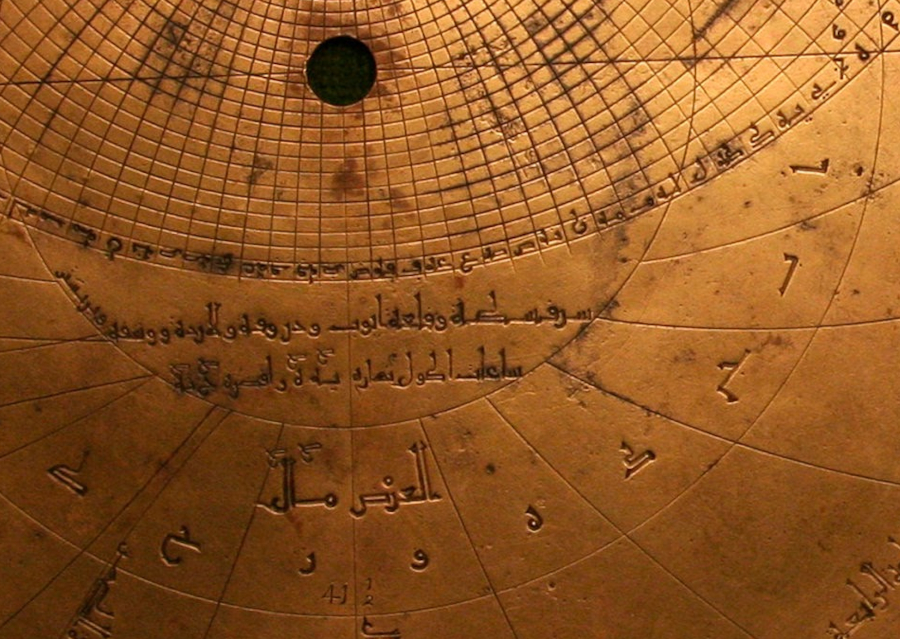

# towngach

## Table of Contents

- [1. Overview](#1-overview)
  - [1-1. What is "Towngach"?](#1-1-what-is-towngach)
  - [1-2. What is This Library For?](#1-2-what-is-this-library-for)
  - [1-3. Which "9 Stars"?](#1-3-which-9-stars)
- [2. Purple-White Stars (紫白星)](#2-purple-white-stars-紫白星)
  - [2-1 Nine Palaces (九宮)](#2-1-nine-palaces-九宮)
  - [2-2. Four Calendrical Levels](#2-2-four-calendrical-levels)
  - [2-3. Three-Epoch-Purple-White (三元紫白)](#2-3-three-epoch-purple-white-三元紫白)
  - [2-4. Daily Purple-White (日家紫白)](#2-4-daily-purple-white-日家紫白)
  - [2-5. Historical Variants](#2-5-historical-variants)
    - [2-5-1. Kyusei Kigaku (九星気学)](#2-5-1-kyusei-kigaku-九星気学)
    - [2-5-1. Xuan-Kong Feng-Shui (玄空風水)](#2-5-1-xuan-kong-feng-shui-玄空飛星風水)
  - [2-6. Implementations](#2-6-implementations)
    - [2-6-1. Kinkaku's Houkan (方鑑)](#2-6-1-kinkakus-houkan-方鑑)
    - [2-6-2. Kyusei Kigaku (九星気学)](#2-6-2-kyusei-kigaku-九星気学)
    - [2-6-3. Mizuno Kigaku (水野気学)](#2-6-3-mizuno-kigaku-水野気学)
  - [2-7. Unresolved Issues](#2-7-unresolved-issues)
- [3. Technical Details](#3-technical-details)
  - [3-1. Implemented Programs](#3-1-implemented-programs)
  - [3-2. Shared Logic](#3-2-shared-logic)
  - [3-3. Scripts](#3-3-scripts)
    - [3-3-1. Checking Mizuno Kigaku](#3-3-1-checking-mizuno-kigaku)
    - [3-3-2. Data Browser](#3-3-2-data-browser)
  - [3-4. Installed NPM Packages](#3-4-installed-npm-packages)
    - [(a) Babel](#a-babel)
    - [(b) ESLint & Prettier](#b-eslint--prettier)
    - [(c) JSDoc](#c-jsdoc)
    - [(d) Jest](#d-jest)
    - [(e) Others](#e-others)
- [4. FAQ](#4-faq)
  - [4-1. Do you have a dictionary?](#4-1-do-you-have-a-dictionary)
  - [4-2. How are "九宮" and "九宫" different?](#4-2-how-九宮-and-九宫-different)
- [6. Resources](#6-resources)
- [7. License](#7-license)
  - [7-1. For Towngach](#7-1-for-towngach)



> I have translations in parenthesis next
> to words related to the East Asian astrology
> and divination. See
> **["Translation Rules"](./docs/translations.md)**
> for details.  
> They are: **"ja"**, **"zh_tw"**,
> **"zh_ch"**, and **"vi"**.

## 1. Overview

### 1-1. What is "Towngach"?

The name _**"Towngach"**_ (`/taʊŋˈɡætʃ/`)
originates from _**"Tawgač"**_ (`/tɑwˈɣɑtʃ/`),
an ancient Turkic term to denote the
_**"Tang Dynasty"**_.  
(see **["What is Towngach"](./docs/towngatch.md)** for details)

### 1-2. What is This Library For?

This is a computational library for the
**"Purple-White Stars" (紫白星 / zi-bai-xing
/ tử bạch tinh)** &mdash; the East Asian
astronomical, calendrical, and directional
tradition &mdash; combining solar-term
and celestial calculations with
historically distinct methods for annual,
monthly, daily, and hourly divination.

### 1-3. Which "9 Stars"?

You now know the library has something
to do with _**"stars"**_.  
Actually, we have _**"9 stars"**_.  
But, for many East Asian traditions
_**"9 stars"**_ means _**"troubles"**_...

You may have heard of the **"Qi-Men Dun-Jia"**
(奇門遁甲 / 奇门遁甲 / kỳ môn độn giáp).  
This is one of the traditions which gives
the foundations to various magical practices
in East Asia. Many traditions derive from
**Qi-Men Dun-Jia**, including **"Feng-Shui"**
(風水 / 风水 / feng-shui / phong thủy) and
they all share the same theoretical and
operational concepts with **Qi-Men Dun-Jia**.

**Qi-Men Dun-Jia** has a concept of the
_**"Nine Stars"**_ (九星 / jiu-xing / cửu tinh).  
As the name suggest, it is obvious we are
dealing with **"9 stars"** here. To be specific,
these are the "9 stars" of _**"The Big Dipper"**_
(北斗七星 / bei-dou qi-xing / chòm sao bắc đẩu).

Now, **Qi-Men Dun-Jia** also has a concept
of the _**"Nine Palaces"**_ (九宮 / 九宫 /
jiu-gong / cửu cung), and this is where
the _"trouble"_ begins... the concept of
the _**"Nine Palaces"**_ (九宮) comes from
the legendary **"Luo-Shu"** (洛書 / 洛书 /
luo-shu / lạc thư) diagram which is known
as a **magic square** (魔法陣) in the West.
When we utilized this 3x3 magic square,
we would assign a _**"star"**_ to each,
and consider that these _**"stars"**_
fly over 1 palace to another &mdash; which
of course &mdash; makes them **"9 stars"**.

As such, for traditions using the concept
of the **"Nine Palaces"** (or of the "Luo-Shu"),
would call these stars, the **"9 stars"**...
As you can imagine, it has been the major
cause of confusions throughout ages...

To name a few, _**"Xuan-Kong Feng-Shui"**_
(玄空風水 / xuan-kong-feng-shui / phong thủy
huyền không) (of China) and _**"Kyusei Kigaku"**_
(九星気学 / 九星气学 / jiu-xing-qi-xue /
cửu tinh khí học) (of Japan) would both say
_**"Nine Stars"**_ (九星) to refer to
the _**"9 stars"**_ belonging to the
_**"Nine Palaces"**_ (九宮) (or of the "Luo-Shu").

To make a clear distinction, for this library
specifically, I would like to refer to
the **"9 stars"** (九星) of the
**"Nine Palaces"** (九宮) as:

- **"Purple-White Stars"**  
  (紫白星 / zi-bai-xing / tử bạch tinh)

It is important to make a distinction
because it has become more common
even in published materials nowadays
to mix up two different systems
by saying **"Nine Stars"**.

By making a distinction here, I want
to explicitly address that this library
does **NOT** deal with the **"Nine Stars"**
which belong to the **"Qi-Men Dun-Jia"**.

Or, conceptually, the "Nine Stars" (九星)
represent the workings of _**"Heaven"**_
(天 / tian / thiên) whereas for the
"Nine Palaces" (九宮), that of _**"Earth"**_
(地 / dì / địa). In a way, we could say
**that the library deals with the _"Earth"_
aspect** of the East-Asian divination.

## 2. Purple-White Stars (紫白星)

### 2-1. Nine-Palaces (九宮)

As already mentioned, for any **Qi-Men** (奇門)
derived traditions, the **"Purple-White Stars"**
have fixed positions defined in the legendary
**"Luo-Shu"** (洛書) diagram.

This is referred to as the **"Nine Palaces"**
(九宮) because it has 9 slots in total,
arranged as a 3x3 matrix.

  
(Source: ["Magic Square Lo Shu.svg" - Wikimedia Commons](https://commons.wikimedia.org/wiki/File:Magic_Square_Lo_Shu.svg))

> A fun fact on planetary correspondences:
> - 3x3 &mdash; Saturn (♄)
> - 4x4 &mdash; Jupiter (♃)
> - 5x5 &mdash; Mars (♂)
> - 6x6 &mdash; Sun (☉)
> - 7x7 &mdash; Venus (♀)
> - 8x8 &mdash; Mercury (☿)
> - 9x9 &mdash; Moon (☽)

A star may be assigned to the **"Central Palace"**
(中宮 / 中宫 / zhong-gong / trung cung) and then
allowed to move through the **"Palace"** (宮 / 宫 /
gong / cung) sequence according to a defined rule.

Depending on the method, this movement may proceed
forward or backward, corresponding to
**"Forward Flight"** (順飛 / 顺飞 / shun-fei /
thuận phi) and **"Reverse Flight"** (逆飛 / 逆飞 /
ni-fei / nghịch phi).

The name **"Purple-White Stars"** (紫白星) has
**"Purple"** (紫) and **"White"** (白) because
it has particular numbers and colors as attributes
given to each star. It starts with the
**"One-White"** (一白 / yi-bai / nhất bạch)
and ends with the **"Nine-Purple"**
(九紫 / jiu-zi / cửu-tử).

This common foundation makes it possible
for apparently different traditions
to share a substantial amount of
computational logic. The same **"Nine Palace"**
structure can support annual, monthly, daily,
and hourly calculations, even when the rules
used to determine the initial star or
the calendrical boundary differ.

### 2-2. Four Calendrical Levels

The **"Purple-White Stars"** (紫白星) are
commonly applied at four calendrical levels:

- **"Annual Calculation"** (年家 / nian-jia / niên gia)
- **"Monthly Calculation"** (月家 / yue-jia / nguyệt gia)
- **"Daily Calculation"** (日家 / ri-jia / nhật gia)
- **"Hourly Calculation"** (時家 / 时家 / shi-jia / thời gia)

These four levels should not necessarily be understood
as four unrelated systems. They share the same
general cosmological vocabulary of
**"Purple-White Stars"** (紫白星) and
the **"Nine Palaces"** (九宮), but each level
may define its own temporal cycles, starting points,
transitions, and rules for determining the initial star.

For this reason, a reusable implementation should
recognize both their shared structure and their
independent calendrical logic.

### 2-3. Three-Epoch-Purple-White (三元紫白)

One major family of methods is the classical
**"Three-Epoch Purple-White"** (三元紫白 /
san-yuan-zi-bai / tam nguyên tử bạch) system
found in Chinese calendrical and selection traditions.

Within this family, annual, monthly, daily,
and hourly Purple-White (紫白) calculations are
treated as related expressions of the same
general system. This historical description
does not represent a single universal method
in the public API.

The repository keeps concrete calculations
under identifiable method families instead.

- **Annual calculation** (年家):  
  Based on the large cycle of the **Three-Epochs**
  (三元 / san-yuan / tam nguyên), traditionally
  expressed through a sequence of 60-year units
  and a larger 180-year cycle.  
  &nbsp;
- **Monthly calculation** (月家):  
  Uses its own relationship between
  **"annual cycles"** (歲運 / 岁运 / sui-yun / tuế vận),
  **"terrestrial branches"** (地支 / di-zhi / địa chi),
  and the **"monthly sequence"** (月建 / yue-jian /
  nguyệt kiến).  
  &nbsp;
- **Daily calculation** (日家):  
  Based on a 60-day unit and a larger cycle
  of 3 of such units &mdash; but this also
  depends on traditions, and I will fully
  explain this in the next section.  
  &nbsp;
- **Hourly calculation** (時家):  
  Uses its own division of time, often derived
  from the classification of the day and
  the sequence of traditional **"double-hours"**
  (時辰 / 时辰 / shi-chen / giờ âm lịch).

These methods form an important baseline for the
library because they provide one of the most
coherent historical families of
**"Purple-White Stars"** (紫白星) calculations.

### 2-4. Daily Purple-White (日家紫白)

As briefly mentioned in the previous section,
the **Daily Purple-White** (日家紫白) calculation
is one of the most important areas of
historical variation covered by the library.

A major classical model treats **60 days** as
one **"Epoch"** (一元 / yi-yuan / nhất nguyên),
with **"3 Epochs"** forming a **180-day** structure.

To change between **Yin** (陰 / 阴 / yin / âm)
and **Yang** (陽 / 阳 / yang / dương) progression,
some methods emphasize calendrical boundaries
associated directly with the **"Solstices"**
(二至 / 二至 / er-zhi / nhị chí) and the
**"Three Epoch"** (三元 / 三元 / san-yuan / tam nguyên).

Other methods use **nearby days** associated
with a set of **"4 branches"**, namely,
**"Zi-Wu-Mao-You"** (子午卯酉 / tý ngọ mão dậu)
being used as practical transition points.

What varies by method is how the initial state,
direction, epoch, and boundary are selected.
Yet, many methods may share the same 60-day
foundation and the same **"Nine Palace Flight"**
(九宮飛泊 / 九宫飞泊 / jiu-gong-fei-bo /
cửu cung phi bạc), while differing only
in the rule that determines when the direction
of movement changes.

From the perspective of
software design, such methods should not
necessarily require completely separate systems.
The library's reusable foundations include:
- **"Nine Palaces"** (九宮)
- **"Purple-White Stars"** (紫白星)
- **"Forward Flight"** (順飛 / 顺飞 / shun-fei / thuận phi
- **"Reverse Flight"** (逆飛 / 逆飞 / ni-fei / nghịch phi)

The historical Houkan daily calculation is documented in
_**[docs/kinkaku.md](./docs/kinkaku.md)**_.

### 2-5. Historical Variants

The traditions represented by this library
should be understood as historical and
technical variants of **"Purple-White Stars"**
(紫白星) calculation rather than as mutually
exclusive systems. In many cases, traditions
may use exactly the same **"Nine-Palace Flight"**
(九宮飛泊 / 九宫飞泊 / jiu-gong-fei-bo /
cửu cung phi bạc) while differing only in how they
determine the **"Starting Star"** (起始星 /
qi-shi-xing / khởi thủy tinh).

In other cases, they may share the same
**"Sixty Gan-Zhi Unit"** (六十干支 / 六十花甲 /
liu-shi-gan-zhi / lục thập hoa giáp) while
differing only in the treatment of a transition
near a **"solar term"** (節氣 / 节气 / jie-qi /
tiết khí) or **"solstice"** (二至).

A useful implementation can therefore
distinguish between:

1. Underlying **"Purple-White Stars"** (紫白星)
2. Rule to determine the **"Three Epochs"** (三元)
3. Rule to select the **"Starting Star"** (起始星)
4. Rule to determine **"Forward Flight"** (順飛)
  or **"Reverse Flight"** (逆飛)
5. Method to determine the relevant **"boundaries"**

#### 2-5-1. Kyusei Kigaku (九星気学)

**Sonoda Shinjiro's** (園田真次郎)
**"Kyusei Kigaku"** (九星気学 / 九星氣學 /
九星气学 / jiu-xing-qi-xue / cửu tinh khí học)
including derived traditions inherit much of
the broader **"Purple-White Stars"** (紫白星)
and the **"Nine Palaces"** (九宮) framework.

For **annual** (年家) and **monthly** (月家)
calculations are generally based on recognizable
calendrical cycles and seasonal boundaries.

On the other hand, for **daily** (日家) and
**hourly** (時家) calculations continue
to depend on the interaction between
the traditional calendar, the
**"Sixty Gan-Zhi Unit"** (六十干支) cycle,
and the **"Nine Palace"** (九宮) movement.

These systems often share substantial
computational logic with earlier
**"Purple-White Stars"** (紫白星) traditions.
Yet, differences may appear in matters
such as the precise definition of
a **"year boundary"**, the handling of
**"solar terms"** (節気), and the treatment
of **"daily transitions"**.

For this reason, modern Japanese methods are
best regarded not as an entirely separate
cosmology, but as a family of related
implementations built upon the same
**"Purple-White Stars"** (紫白星) foundation.

#### 2-5-2. Xuan-Kong Feng-Shui (玄空風水)

The library may also be useful for traditions
associated with **"Xuan-Kong Fei-Xing Feng-Shui"**
(玄空飛星風水 / 玄空飞星风水 /
xuan-kong-fei-xing-feng-shui / phong thủy
huyền không phi tinh) &mdash;
or **"Xuan-Kong Feng-Shui"** (玄空風水) for short.
This tradition is widely known in the West as
_**"Flying Star Feng-Shui"**_.

These systems use the **"Nine Palaces"** (九宮)
and the movement of numbered stars, and therefore
share a natural computational vocabulary with
**"Purple-White Stars"** (紫白星) calculation.

However, the concept of
**"Three-Epochs-Nine-Periods"** (三元九運 /
三元九运 / san-yuan-jiu-yun / tam nguyên cửu vận)
should not be confused with the **"Three Epochs"**
(三元) divisions used in annual, monthly, daily,
or hourly **"Purple-White"** (紫白) calculations.

The two systems may both use the term
**"Three Epochs"** (三元), but they describe
different temporal structures and serve
different purposes. For this reason,
**Xuan-Kong** (玄空) calculations should be
treated as closely related to the library's
**"Purple-White Stars"** (紫白星) core without
assuming that every temporal rule can be
shared directly.

### 2-6. Implementations

The intended scope of this library is
the broad family of calculations in which
the **"Purple-White Stars"** (紫白星) move
through the **"Nine Palaces"** (九宮) across
annual, monthly, daily, and hourly time scales.

It includes useful computational foundations
that developed in China and Japan, such as
**"Nine Palace Flight"** (九宮飛泊) &mdash;
often referred to as **"Flying Star"**
(飛星 / 飞星 / fei-xing / phi tinh) traditions.

The library does not attempt, however, to treat
every historical system that uses the name
**"Nine Stars"** (九星) as part of the same
algorithm, especially because (1) **"Nine Stars"**
of **"Qi-Men Dun-Jia"** (奇門遁甲) and
(2) **"Three Epochs"** (三元) divisions
belong to different technical contexts.

The goal here is to preserve the specific family
of **"Purple-White Stars"** (紫白星) calculations
based on the numbered stars, the **"Nine Palaces"**
(九宮), and their historically distinct, but
structurally related methods of movement.

The current implementation order for
**"Purple-White Stars"** (紫白星) is:

1. **"Mizuno Kigaku"** (水野気学)
2. **"Houkan"** (方鑑 / 方鉴 / fang-jian / phương giám)
3. **"Kyusei Kigaku"** (九星気学)
4. **"Xuan-Kong Feng-Shui"** (玄空風水)

**"Mizuno Kigaku"** and **"Houkan"** are
currently the complete production methods.  
**"Kyusei Kigaku"** (九星気学) has **annual** (年家)
and **monthly** (月家) calculations implemented,
while its **daily** (日家) and **hourly** (時家)
calculations remain unresolved.  
**"Xuan-Kong Feng-Shui"** (玄空風水) is not
yet implemented.

#### 2-6-1. Kinkaku's Houkan (方鑑)

**Matsuura Kinkaku** (松浦琴鶴)'s
**"Houkan"** (方鑑) is treated as
a separate historical reconstruction family.
The detailed reconstruction is documented in
**[docs/kinkaku/index.md](./docs/kinkaku.md)**.

The current implementation status is:

- **Annual calculation** (年家):  
  Implemented from the documented 180-year **"Three Epochs"** structure.
- **Monthly calculation** (月家):  
  Implemented from the documented 180-month **"Three Epochs"** structure and astronomical **"Solar-Term Boundary"**.
- **Daily calculation** (日家):  
  The 6 ordinary starting states and
  the historical **"Leap Nine Stars"**
  (閏九星 / 闰九星 / run-jiu-xing /
  nhuận cửu tinh) recipe are implemented.
  The leap procedure uses the later
  **"Jia-Zi"** (甲子 / jia-zi / giáp-tý)
  selected in the documented winter case.
- **Hourly calculation** (時家):  
  The examined **"Houkan"** hourly rule
  is implemented.

The daily leap implementation is event-driven:
when **"Dong-Zhi"** (冬至 / đông chí) or
**"Xia-Zhi"** (夏至 / hạ chí) has
a traditional day of **"Jia-Wu"** (甲午 /
jia-wu / giáp-ngọ), a 60-day leap interval
starts 30 days later at the **"Later Jia-Zi"**.
Winter is Reverse-First / Forward-Second;
summer is Forward-First / Reverse-second.
The summer later **"Jia-Zi"** rule is
an explicit implementation decision based
on the confirmed winter rule and
the parallel summer structure.

This implementation is intended to reproduce
a historical recipe. It does not require
a universal closed-form phase equation, and
it does not borrow **"Kyusei Kigaku"**
(九星気学) rules to fill unresolved
**"Houkan"** areas.

#### 2-6-2. Kyusei Kigaku (九星気学)

As described in **"2-5-1"**, when
**Sonoda Shinjiro** (園田真次郎) introduced
**"Kyusei Kigaku"** (九星気学), he eliminated
components other than those corresponding to
the **"Purple-White Stars"** (紫白星) system.

#### 2-6-3. Mizuno Kigaku (水野気学)

Although less recognized, **Mizuno Yoshitome**
(水野義留) was known during the 1970s for bringing
astronomical precisions to the **daily** (日家)
and **hourly** (時家).

**"Mizuno Kigaku"** (水野気学) shares
the documented rules of **"Honmei-Sei"**
(本命星 / ben-ming-xing / sao bản mệnh) of
**"Kyusei Kigaku"** (九星気学) &mdash; or
_**"Ming-Gua"**_ (命卦 / mệnh quái) of
Taiwanese/Vietnamese traditions.

However, at the time of Mizuno's work,
**"Kyusei Kigaku"** (九星気学) suffered from
**timing lags** because it determines
seasonal transitions based on the
**"Jia-Zi Day"** (甲子日 / jia-zi-ri /
giáp-tý nhật).

To address this, **Mizuno** sought to overcome
this structural looseness of **"Kyusei Kigaku"**
(九星気学) by incorporating the
**"Zi-Bai-Jue"** (紫白诀 / zi-bai-jue /
tử bạch quyết) of **Xuan-Kong Feng-Shui**
(玄空風水) into **daily** and **hourly**
calculations.

Thus, **"Mizuno Kigaku"** (水野気学) shares
annual and monthly infrastructure with
the **"Kyusei Kigaku"** (九星気学) while keeping
its direct astronomical daily and seasonal
hourly rules distinct.

### 2-7. Unresolved Issues

The repository still contains unresolved
method-specific rules. The current status is:

- **"Kyusei Kigaku"**
  - Daily calculation: unresolved.
  - Hourly calculation: unresolved.
- **"Xuan-Kong Feng-Shui"** family:  
  - Not implemented

Unresolved historical rules are kept
explicit in the source instead of being
filled with a modern convention.

## 3. Technical Details

### 3-1. Implemented Programs

As already mentioned, we have the following
roadmap for implementations:

1. **"Kyusei Kigaku"** (九星気学)
2. **"Houkan"** (方鑑)
3. **"Mizuno Kigaku"** (水野気学)
4. **"Xuan-Kong Feng-Shui"** (玄空風水)

**"Mizuno Kigaku"** and **"Houkan"** are currently
implemented as complete production methods.  
**"Kyusei Kigaku"** is partially implemented;  
**"Xuan-Kong Feng-Shui"** is not yet implemented.  

(for detailed specifications about
programs implemented, see
_**["Library Specifications"](./src/README.md)**_)

### 3-2. Shared Logic

The main purpose of supporting multiple traditions
is not to erase their differences, but to identify
where their computational structures
genuinely coincide.

The **"Nine Palaces"** (九宮), the sequence of
**"Purple-White Stars"** (紫白星), and the concepts
of **Forward Flight** (順飛) and **Reverse Flight**
(逆飛) provide a common foundation. These can often
be implemented once and reused.

The determination of the **Starting Star** (起始星),
however, may depend on the annual, monthly, daily,
or hourly cycle. Likewise, the definition of
a calendrical boundary may depend on **Solar Terms**
(節気), solstices (二至), the **Sixty Gan-Zhi Unit**
(六十干支), or tradition-specific rules.

The implementation therefore separates reusable
**"Purple-White"** foundations under
`src/purple_white/core/` from identifiable
calculation methods under `src/purple_white/methods/`.
Shared structures do not imply identical
historical algorithms.

### 3-3. Scripts

#### 3-3-1. Check Script for Mizuno Kigaku (水野気学)

The repository includes a small manual checker
for **"Mizuno Kigaku"** (水野気学) calculations:

```bash
node scripts/check_mizuno.js
```

When run interactively, the script asks for
the year, month, day, hour, and minute.
Blank answers use the predefined example datetime:

```text
1985-10-26 01:35:00
```

You can also provide the values as positional
arguments:

```bash
node scripts/check_mizuno.js 1985 10 26 1 35
```

The checker reports the hourly stem and branch,
**Yin/Yang Dun** (陰陽遁 / 阴阳遁 / yin-yang-dun /
âm dương độn), **Three-Yuan** (三元 / san-yuan /
tam nguyên), **Purple-White Star** (紫白星),
**Flight** (飛泊),
the **Monthly Solar-term Boundary**
(節気境界 / 節氣交節 / 节气交节 / jie-qi-jiao-jie /
tiết khí giao tiết), and the documented
**"daily"** structure. **Mizuno** annual,
monthly, daily, and hourly calculations are
implemented. Other method families keep
unresolved historical rules explicit
where the source material is not yet sufficient.

The example datetime is accompanied by
the following message:

> Marty McFly escaping the Libyans at Twin Pines Mall

The script uses UTC-normalized Towngach dates
and the existing astronomy adapter.

#### 3-3-2. Data Browser

The repository includes a script that dumps all
module datasets from `src/` as formatted tables:

```bash
node scripts/data_browser.js
```

It iterates over all data modules (stars, elements,
luoshu, solar terms, stems, branches, palaces,
Sixty Gan-Zhi Unit, and three-epochs) and prints a
readable table for each one, showing keys and their
properties along with the source file path. Useful
for exploring what data is available and where it
lives.

It emits data like this:
```
$ node ./scripts/data_browser.js

Module: purple_white/core/nine_stars/star.js
star | number | element | color
---- | ------ | ------- | -----
one_white | 1      | water   | white
two_black | 2      | earth   | black
three_jade | 3      | wood    | jade 
four_green | 4      | wood    | green
five_yellow | 5      | earth   | yellow
six_white | 6      | metal   | white
seven_red | 7      | metal   | red  
eight_white | 8      | earth   | white
nine_purple | 9      | fire    | purple
...
```

### 3-4. Installed NPM Packages

#### (a) Babel

- core-js
- @babel/cli
- @babel/core
- @babel/preset-env
- babel-loader
- babel-plugin-preval
- babel-plugin-polyfill-corejs

#### (b) ESLint & Prettier

- prettier
- eslint
- @eslint/js
- eslint-config-prettier
- eslint-plugin-prettier
- @stylistic/eslint-plugin

#### (c) JSDoc

- jsdoc
- jsdoc-tsimport-plugin
- jsdoc-plugin-intersection
- typescript
- @types/ramda

#### (d) Jest

- jest
- babel-jest

#### (e) Others

- rimraf
- nodemon
- concurrently
- cross-env
- ramda
- moment
- moment-timezone
- csv-parse

```
# Why core-js belongs in production?
# Since @babel/preset-env injects helper imports
# directly into the runtime code
# (e.g. import "core-js/modules/es.array.flat.js"),
# the deployment environment needs to have
# core-js installed in main dependencies.
# If it is only in devDependencies, the app will
# crash in production with a "Module not found"
# error when it tries to run those polyfills.

npm install --save core-js ramda luxon csv-parse

npm install --save-dev \
  @babel/cli @babel/core @babel/preset-env @babel/preset-typescript \
  babel-jest babel-loader babel-plugin-preval \
  eslint @eslint/js eslint-plugin-prettier eslint-config-prettier \
  @stylistic/eslint-plugin globals \
  jsdoc jsdoc-tsimport-plugin jsdoc-plugin-intersection \
  typescript @types/ramda jest \
  rimraf nodemon concurrently cross-env
```

## 4. FAQ

### 4-1. Do you have a dictionary?

A. Yes. See _**["Terminology"](./docs/terminology.md)**_
for all the list of terms used in this repo.

### 4-2. How are "九宮" and "九宫" different?

A. They are different.
- **九宮** (Japanese Kanji / Traditional Chinese):  
  Uses the traditional form of the second
  character, `宮`, where the two square "mouth"
  components (`口`) inside are connected by
  a stroke or written cleanly as two distinct
  boxes depending on the typeface, matching
  standard traditional Chinese variants.
- **九宫** (Simplified Chinese):  
  In this form, the second character is written
  as `宫`, which simplifies the inner component
  by removing the stroke that links the two
  boxes or changing the internal structure to
  a single stroke connection (`宀` + `吕`)
  depending on the script standards.

## 6. Resources

To supplement this document, the repository
provides the following materials:

- **[Definitions](./docs/definitions.md)**
- **[Kinkaku's "Houkan"](./docs/kinkaku.md)**
- **[Library Specifications](./src/README.md)**
- **[What is Towngach?](./docs/towngatch.md)**
- **[Terminology](./docs/terminology.md)**


## 7. License

### 7-1. For Towngach

Dual-licensed under either of the following.  
Choose whichever you prefer.

- The UNLICENSE ([LICENSE.UNLICENSE](LICENSE.UNLICENSE))
- MIT license ([LICENSE.MIT](LICENSE.MIT))
